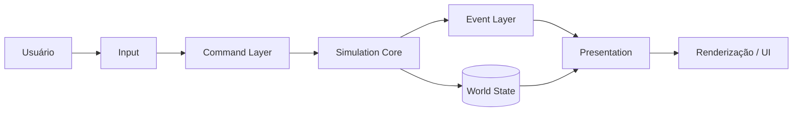
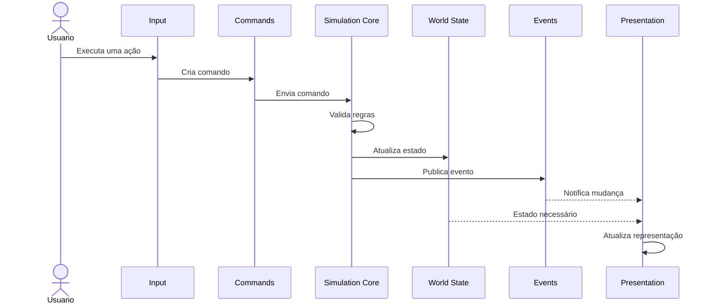

# AVA_C11

Documentação arquitetural para a atividade da Unidade III.

> Este repositório é um artefato acadêmico autocontido. Ele apresenta um sistema fictício inspirado em princípios de arquitetura de software, sem expor código, assets, nomes internos ou decisões proprietárias de qualquer projeto privado.

## 1. Objetivo

O objetivo é documentar uma arquitetura de software de forma suficientemente clara para apoiar análise, discussão e futura implementação, usando diagramas como código e uma jornada crítica do sistema.

O sistema de referência representa um jogo/simulador com mundo persistente, no qual a simulação possui regras próprias e a camada visual apresenta o estado para o usuário.

## 2. Escopo

### Incluído

- núcleo de simulação independente da apresentação;
- entidades e estado do mundo;
- passagem de tempo por ticks lógicos;
- entrada de ações como comandos;
- saída de mudanças relevantes como eventos;
- camada de apresentação/renderização;
- preocupação explícita com desempenho e evolução incremental;
- documentação arquitetural em Markdown e Mermaid.

### Fora do escopo

- implementação de gameplay;
- código-fonte de um jogo real;
- assets gráficos, áudio ou modelos 3D;
- persistência definitiva em banco de dados;
- multiplayer;
- escolha de infraestrutura de produção;
- detalhes de implementação que ainda não foram decididos.

## 3. Visão arquitetural

A arquitetura separa **simulação** de **apresentação**.

A camada de apresentação recebe interação do usuário e transforma essa intenção em comandos. O núcleo de simulação valida e processa os comandos, atualiza o estado do mundo segundo suas regras e produz eventos. A apresentação consome o estado/eventos necessários e atualiza a representação visual.

Essa separação reduz o acoplamento entre regras de negócio/simulação e tecnologia de apresentação, além de facilitar testes e evolução futura.

## 4. Responsabilidades

| Componente | Responsabilidade | Não deve assumir |
|---|---|---|
| Input | Capturar intenção do usuário | Aplicar regras de simulação |
| Presentation | Exibir o estado e reagir visualmente a eventos | Ser a fonte da verdade do mundo |
| Command Layer | Representar ações solicitadas | Alterar estado diretamente |
| Simulation Core | Aplicar regras, atualizar estado e controlar ticks | Renderizar ou depender da UI |
| World/Entities | Representar estado e entidades simuladas | Conhecer detalhes de renderização |
| Event Layer | Comunicar mudanças relevantes | Substituir o estado oficial |
| Infrastructure | Fornecer serviços técnicos quando necessários | Conter regras centrais de gameplay |

## 5. Princípios arquiteturais

1. **Simulation Core independente da apresentação** — as regras da simulação não devem depender de APIs visuais.
2. **Estado com fonte de verdade única** — o estado simulado pertence ao núcleo de simulação.
3. **Comandos para entrada** — ações externas entram no núcleo como intenções explícitas.
4. **Eventos para comunicação de mudanças** — acontecimentos relevantes podem ser publicados para consumidores interessados.
5. **Tempo lógico** — a evolução do mundo deve ser baseada em uma noção de tempo/tick da simulação, não simplesmente no frame rate.
6. **Baixo acoplamento** — componentes devem depender de contratos e responsabilidades claras.
7. **Evolução incremental** — otimizações mais complexas devem ser introduzidas quando houver evidência de necessidade.

## 6. Decisões e restrições conhecidas

### Decisões

- A apresentação visual é separada do núcleo de simulação.
- O núcleo é tratado como a autoridade sobre o estado do mundo.
- Comandos representam solicitações de mudança.
- Eventos comunicam mudanças relevantes aos consumidores.
- A arquitetura deve permitir testes do núcleo sem exigir renderização.
- Performance deve ser tratada de forma incremental, orientada por medição.

### Restrições

- O documento não pressupõe uma implementação específica para todos os detalhes.
- Não se deve introduzir tecnologia adicional apenas por preferência arquitetural.
- A apresentação não deve conter a regra central da simulação.

## 7. Decisões ainda em aberto

Para que uma implementação futura não precise inventar decisões importantes, ainda seria necessário definir:

- formato concreto das entidades e componentes de estado;
- catálogo de comandos e seus parâmetros;
- catálogo de eventos;
- política de frequência dos ticks;
- estratégia de persistência;
- tratamento de erros e comandos inválidos;
- estratégia de serialização;
- requisitos quantitativos de desempenho;
- estratégia de paralelização, caso necessária;
- contratos detalhados entre simulação e apresentação.

## 8. Diagramas

### 8.1 Diagrama estrutural

O diagrama abaixo apresenta os principais blocos e suas relações.



Versão detalhada: [`docs/diagrams/architecture.md`](docs/diagrams/architecture.md).

### 8.2 Jornada crítica

A jornada crítica documentada é: **usuário solicita uma ação → comando é criado → simulação processa o comando → estado é atualizado → evento é produzido → apresentação reflete a mudança**.



Versão detalhada: [`docs/diagrams/critical-journey.md`](docs/diagrams/critical-journey.md).

## 9. O que foi inferido vs. o que foi definido

### Inferido a partir dos princípios arquiteturais

- a simulação deve ser isolável da camada visual;
- comandos são uma fronteira adequada para entrada;
- eventos são uma fronteira adequada para comunicar mudanças;
- o tempo lógico deve ser tratado explicitamente;
- testes e benchmarks podem ser executados sem depender da renderização;
- otimizações devem ser introduzidas conforme evidências.

### Definido neste artefato

- nomes dos blocos apresentados nos diagramas;
- jornada crítica escolhida para a atividade;
- escopo e limites documentados neste README;
- itens que permanecem deliberadamente em aberto.

Nenhuma decisão em aberto deve ser considerada automaticamente definida por este documento.

## 10. Como uma IA deve usar esta documentação

Uma IA que receba este repositório deve:

1. tratar o `Simulation Core` como autoridade do estado simulado;
2. manter a separação entre simulação e apresentação;
3. representar ações externas como comandos;
4. usar eventos para comunicar mudanças relevantes;
5. evitar criar detalhes de domínio que não estejam documentados;
6. marcar explicitamente qualquer decisão nova necessária para implementação;
7. preferir soluções simples antes de introduzir otimizações ou infraestrutura complexa;
8. manter os diagramas atualizados quando uma decisão arquitetural for alterada.

## 11. Estrutura do repositório

```text
AVA_C11/
├── README.md
└── docs/
    └── diagrams/
        ├── architecture.md
        └── critical-journey.md
```

## 12. Ferramentas

- Markdown para documentação;
- Mermaid para diagramas como código;
- Git/GitHub para versionamento e colaboração.

## 13. Critério de qualidade

A documentação é considerada adequada quando outra pessoa consegue compreender:

- quais são os principais componentes;
- qual responsabilidade pertence a cada componente;
- como uma ação atravessa o sistema;
- onde o estado é mantido;
- quais decisões já foram tomadas;
- quais decisões ainda precisam ser tomadas;
- quais pontos não devem ser inventados durante uma implementação.
