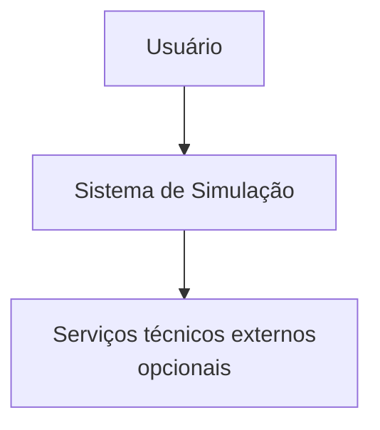
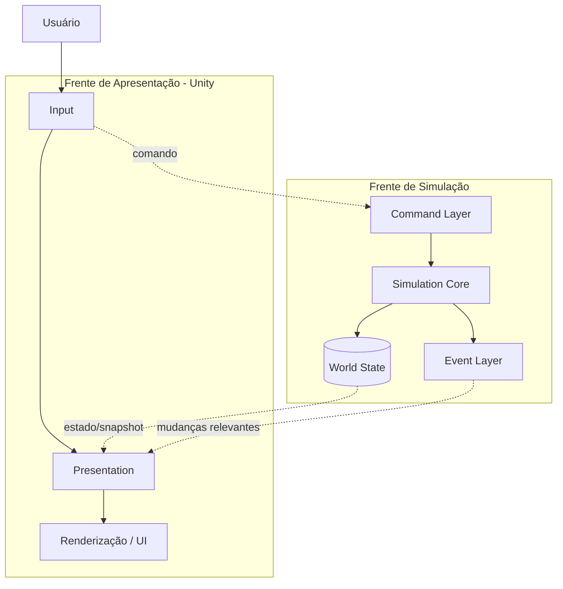
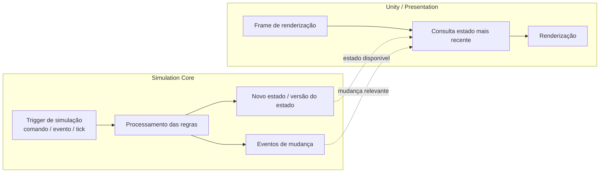
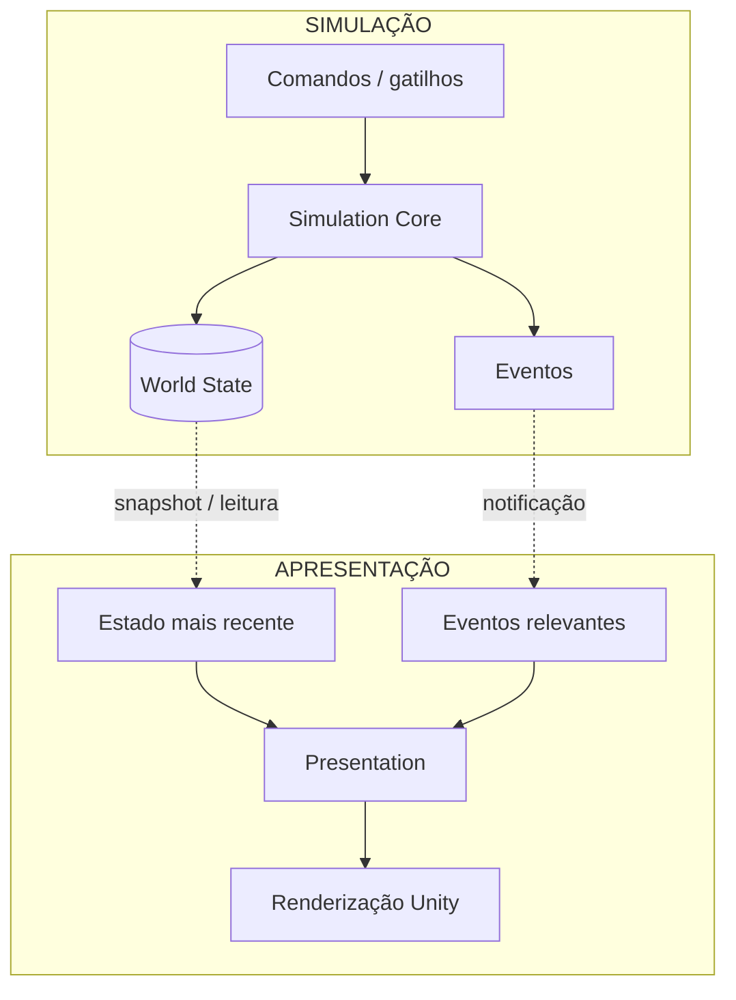

# Diagrama de Arquitetura

## Contexto

Este documento descreve a visão estrutural do sistema de estudo usando uma decomposição inspirada no modelo C4. O foco é mostrar **fronteiras, responsabilidades e dependências**, e não representar uma sequência temporal de execução.

> **Ponto importante:** `Presentation` não é uma etapa do processamento interno do `Simulation Core`. A apresentação é uma frente independente da simulação. Ela consulta/recebe o resultado da simulação e cuida da renderização. O `Simulation Core` não depende do frame rate da Unity para executar suas regras.

## Nível de contexto

## Nível de contêineres

A visão correta é separar as duas frentes principais: **simulação** e **apresentação**.

### Como interpretar as linhas pontilhadas

As conexões entre as duas frentes representam **troca de informação**, não uma cadeia de execução.

- `Input` envia uma intenção/comando para a simulação.
- `World State` disponibiliza o estado que a apresentação precisa representar.
- `Event Layer` comunica mudanças relevantes que podem exigir atualização visual.
- A `Presentation` não entra no processamento das regras do `Simulation Core`.
- O `Simulation Core` não chama a renderização e não precisa conhecer `UnityEngine`.

## Separação entre simulação e renderização

A diferença fundamental pode ser representada assim:

### Regra de execução

A simulação **não deve ser modelada como algo que precisa ser executado a cada frame da Unity**.

A execução do núcleo ocorre quando existe um gatilho da simulação, por exemplo:

- comando recebido;
- evento interno agendado;
- avanço do relógio/tick lógico, quando aplicável;
- outra alteração válida do mundo.

A Unity, por outro lado, possui seu próprio ciclo de atualização/renderização. Ela pode continuar renderizando os frames normalmente usando o **último estado conhecido**, mesmo quando nenhuma mudança ocorreu na simulação.

Assim, podem existir vários frames visualizados sem qualquer novo processamento do núcleo.

## Responsabilidades

| Contêiner | Responsabilidade principal | Natureza |
|---|---|---|
| Input | Capturar ações/intenção do usuário. | Unity / apresentação |
| Presentation | Transformar estado/eventos em representação visual. | Unity / apresentação |
| Command Layer | Representar solicitações de alteração do mundo. | Simulação |
| Simulation Core | Aplicar regras e produzir novos estados/eventos. | Simulação |
| World State | Manter a fonte de verdade do estado simulado. | Simulação |
| Event Layer | Comunicar mudanças relevantes da simulação. | Simulação |
| Renderização / UI | Desenhar a representação atual. | Unity / apresentação |

## Regras de dependência

- `Input` não altera o estado do mundo diretamente.
- `Presentation` não é autoridade sobre o estado simulado.
- `Command Layer` envia solicitações ao `Simulation Core`.
- `Simulation Core` é independente da renderização.
- `World State` pertence ao domínio da simulação.
- `Event Layer` comunica mudanças, mas não substitui o estado oficial.
- A Unity pode consultar o último estado disponível sem provocar uma nova simulação.
- Um novo frame de renderização não implica necessariamente um novo processamento do `Simulation Core`.

## Fluxo de dados, não fluxo único de execução

Este diagrama deve ser lido como **dois ciclos independentes que compartilham informação**, e não como `Simulation Core → Presentation → Renderização` formando uma única pipeline de execução.

## Decisões deliberadamente não especificadas

Este documento não define:

- linguagem ou framework obrigatório para cada módulo;
- banco de dados específico;
- protocolo de comunicação específico;
- estrutura interna das entidades;
- mecanismo exato de mensageria;
- estratégia de concorrência/paralelismo;
- frequência numérica dos ticks;
- mecanismo concreto de snapshot/versionamento do estado.

Essas escolhas devem ser feitas somente quando requisitos adicionais as tornarem necessárias.
