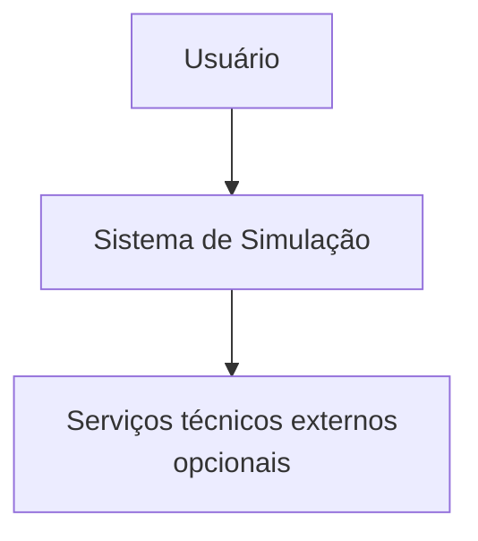
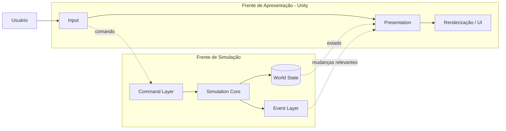

# Diagrama de Arquitetura

## Contexto

Este documento apresenta a visão estrutural do sistema usando uma decomposição inspirada no modelo C4. O objetivo é mostrar **quais são os principais blocos, suas responsabilidades e suas relações**, sem representar uma sequência temporal de execução.

> `Presentation` pertence à frente de apresentação e não é um componente interno do processamento do `Simulation Core`.

## Nível de contexto

## Nível de contêineres

O sistema é organizado em duas frentes principais: **simulação** e **apresentação**.

### Responsabilidades dos contêineres

| Contêiner | Responsabilidade principal | Frente |
|---|---|---|
| Input | Capturar ações e intenção do usuário. | Apresentação |
| Presentation | Consumir informações da simulação e manter a representação visual. | Apresentação |
| Renderização / UI | Desenhar a representação atual. | Apresentação |
| Command Layer | Representar solicitações de alteração do mundo. | Simulação |
| Simulation Core | Aplicar regras da simulação. | Simulação |
| World State | Manter a fonte de verdade do estado simulado. | Simulação |
| Event Layer | Comunicar mudanças relevantes da simulação. | Simulação |

### Relações principais

- `Input` não altera o estado do mundo diretamente.
- `Command Layer` recebe solicitações e as encaminha ao `Simulation Core`.
- `Simulation Core` altera o `World State` conforme as regras válidas.
- `Event Layer` comunica mudanças relevantes aos consumidores interessados.
- `Presentation` usa estado e eventos para representar visualmente o mundo.
- `Simulation Core` não depende da renderização nem precisa conhecer APIs específicas da Unity.

## Fronteiras arquiteturais

A separação mais importante neste nível é a **fronteira de responsabilidade**:

- a frente de **simulação** é autoridade sobre regras e estado;
- a frente de **apresentação** é responsável por entrada, representação e renderização;
- as duas frentes trocam informações por contratos definidos;
- a apresentação não possui autoridade para decidir o estado do mundo.

O funcionamento temporal dessas duas frentes é detalhado em [`execution-model.md`](execution-model.md). A jornada de uma ação é detalhada em [`critical-journey.md`](critical-journey.md).

## Regras de dependência

1. O estado oficial do mundo pertence à simulação.
2. A apresentação não contém a regra central do domínio.
3. A renderização não é uma dependência do `Simulation Core`.
4. Um novo frame não deve ser interpretado, por si só, como uma solicitação para executar as regras da simulação.
5. O mecanismo concreto de comunicação entre as frentes permanece uma decisão de implementação.

## Decisões deliberadamente não especificadas

Este documento não define:

- linguagem ou framework obrigatório;
- banco de dados específico;
- protocolo de comunicação específico;
- estrutura interna das entidades;
- mecanismo exato de mensageria;
- estratégia de concorrência/paralelismo;
- frequência numérica dos ticks;
- mecanismo concreto de snapshot/versionamento do estado.

Essas escolhas devem ser feitas somente quando requisitos adicionais as tornarem necessárias.
