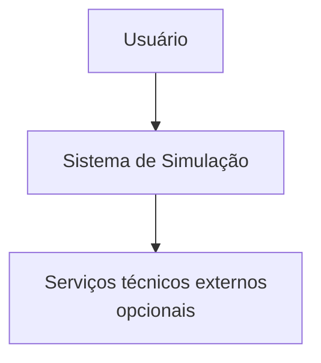
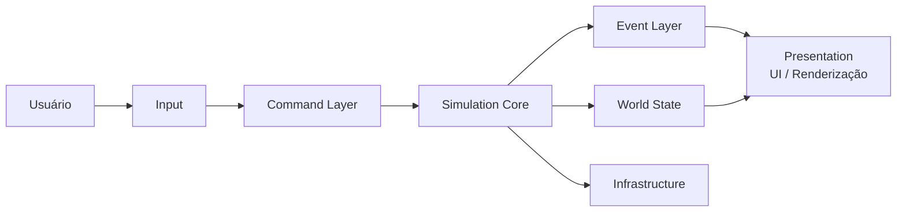
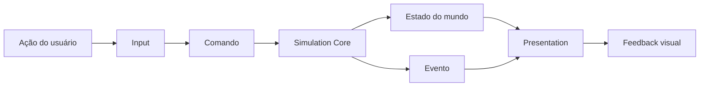

# Diagrama de Arquitetura

## Contexto

Este documento descreve a visão estrutural do sistema de estudo usando uma decomposição inspirada no modelo C4. O foco da atividade é mostrar fronteiras, responsabilidades e dependências, e não representar classes ou implementação detalhada.

## Nível de contexto

O usuário interage com uma aplicação que possui uma camada de apresentação e um núcleo responsável pela simulação.

## Nível de contêineres

### Responsabilidades

| Contêiner | Responsabilidade principal |
|---|---|
| Input | Capturar ações/intenção do usuário. |
| Presentation | Exibir o estado e produzir feedback visual. |
| Command Layer | Converter intenção em comandos explícitos. |
| Simulation Core | Aplicar regras, processar comandos e avançar a simulação. |
| World State | Manter o estado atual das entidades e do mundo. |
| Event Layer | Distribuir acontecimentos relevantes da simulação. |
| Infrastructure | Encapsular serviços técnicos necessários ao sistema. |

## Regras de dependência

- `Input` não altera o estado do mundo diretamente.
- `Presentation` não é autoridade sobre o estado simulado.
- `Command Layer` envia solicitações ao `Simulation Core`.
- `Simulation Core` pode alterar `World State` conforme as regras.
- `Event Layer` comunica resultados/mudanças aos consumidores.
- `Simulation Core` não deve depender de detalhes de renderização.
- `Infrastructure` deve permanecer subordinada às necessidades do domínio, e não definir as regras centrais.

## Fluxo arquitetural

## Decisões deliberadamente não especificadas

Este diagrama não define:

- linguagem ou framework obrigatório para cada módulo;
- banco de dados específico;
- protocolo de comunicação específico;
- estrutura interna das entidades;
- mecanismo exato de mensageria;
- estratégia de concorrência/paralelismo.

Essas escolhas devem ser feitas somente quando requisitos adicionais as tornarem necessárias.
