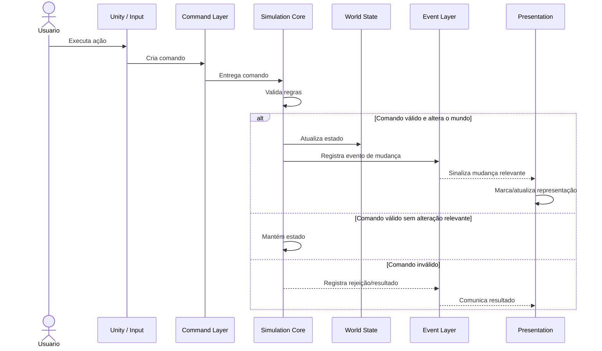
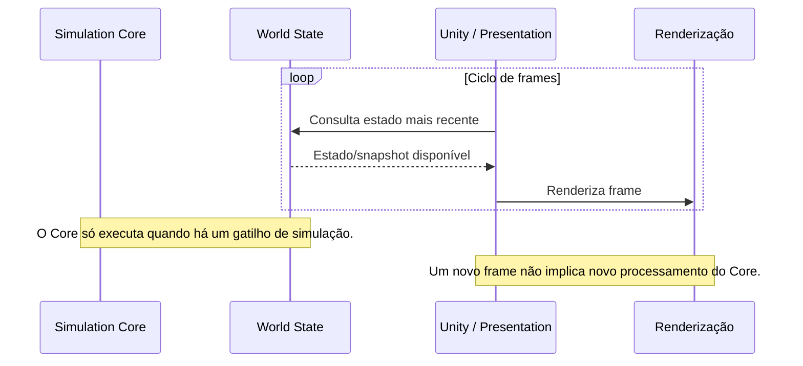

# Jornada Crítica — Ação e Atualização Visual

## Objetivo

Documentar o comportamento do sistema quando uma ação altera o mundo e mostrar a separação entre o processamento da simulação e o ciclo de renderização da Unity.

A jornada crítica não deve sugerir que a Unity executa a simulação a cada frame. Existem dois ciclos relacionados, porém independentes:

1. **Simulação:** processa comandos e mudanças do mundo.
2. **Apresentação:** renderiza continuamente a partir do estado mais recente disponível.

## Cenário

O usuário executa uma ação. A Unity captura essa intenção e envia um comando para o núcleo. O núcleo valida e processa a alteração. Se o mundo realmente mudar, o novo estado e os eventos relevantes ficam disponíveis para a apresentação. A Unity então reflete essa mudança no próximo ciclo de renderização.

## Sequência da mudança



## Ciclo independente de renderização

A renderização possui seu próprio ciclo:



## Modelo mental

```text
                    ┌───────────────────────────────┐
                    │       CICLO DA SIMULAÇÃO       │
                    │                               │
 Comando ──────────►│ Simulation Core               │
                    │       │                       │
                    │       ├──► World State        │
                    │       └──► Eventos             │
                    └──────────────┬────────────────┘
                                   │
                         estado / mudanças
                                   │
                                   ▼
                    ┌───────────────────────────────┐
                    │       CICLO DA UNITY          │
                    │                               │
 Usuário ──► Input ─►│ Presentation ──► Render      │
                    │       ▲                       │
                    │       │ estado mais recente   │
                    └───────────────────────────────┘
```

## Regras fundamentais

- **Renderizar não significa simular.**
- A Unity pode renderizar vários frames sem que o estado do mundo tenha mudado.
- Uma alteração no mundo pode provocar uma atualização visual, mas a renderização continua sendo responsabilidade da Unity.
- O `Simulation Core` não deve depender do `Update`, `FixedUpdate` ou de outro ciclo visual específico da Unity como autoridade temporal do domínio.
- A apresentação pode consultar o último estado/snapshot conhecido.
- Eventos são úteis para sinalizar mudanças, mas o estado simulado continua sendo a fonte de verdade.
- O núcleo não deve executar processamento de domínio apenas porque um novo frame foi desenhado.

## Sobre ticks

O tick lógico pertence ao ciclo da simulação. Ele não deve ser confundido com o frame de renderização.

Um tick pode ser usado para avançar o mundo mesmo quando não existe uma nova ação do usuário. Nesse caso, a simulação continua independente e, quando houver uma mudança observável, a apresentação poderá refletir o novo estado.

A frequência e a política exata dos ticks permanecem uma decisão de implementação em aberto.

## Por que esta jornada é crítica?

Ela deixa explícita a fronteira que mais facilmente gera um erro arquitetural: colocar o núcleo dentro do ciclo de renderização.

O objetivo é permitir que:

- o mundo seja processado independentemente da taxa de FPS;
- a Unity continue renderizando sem recalcular as regras do mundo em cada frame;
- mudanças sejam propagadas quando realmente houver algo novo para representar;
- o núcleo seja testado sem depender da Unity.
