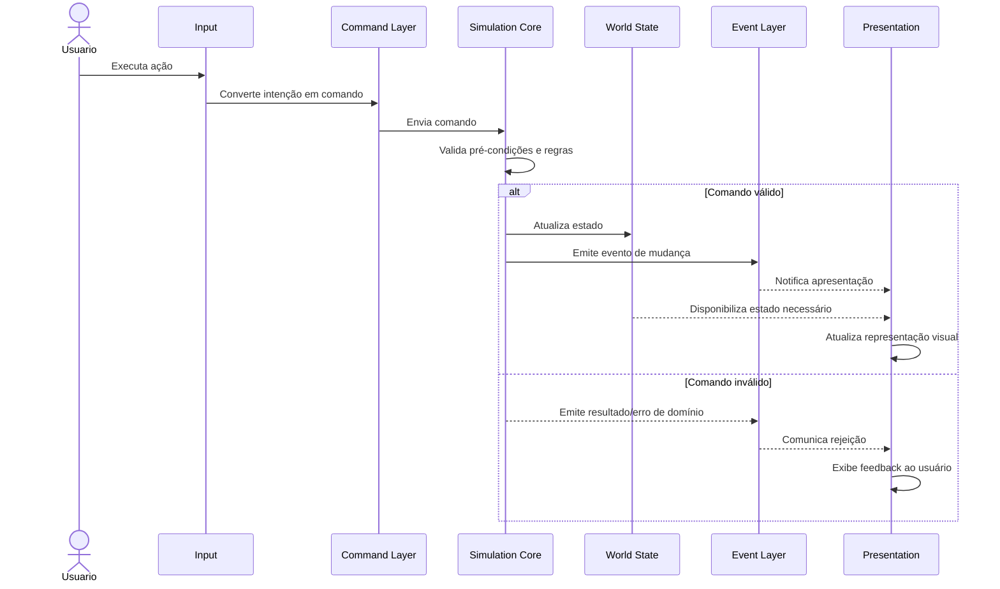

# Jornada Crítica — Executar uma Ação

## Objetivo

Documentar o comportamento de uma ação do usuário desde a entrada até a atualização da representação visual.

A jornada foi escolhida porque atravessa a principal fronteira arquitetural: **apresentação → comando → simulação → estado/evento → apresentação**.

## Cenário

O usuário executa uma ação disponível na aplicação. A interface não aplica a regra de negócio por conta própria. Ela apenas captura a intenção e a encaminha como um comando.

## Sequência

## Passo a passo

1. **Entrada:** o usuário realiza uma ação.
2. **Interpretação:** `Input` identifica a intenção e produz um comando.
3. **Fronteira:** o comando é entregue ao `Simulation Core`.
4. **Validação:** o núcleo verifica se a ação é permitida pelas regras conhecidas.
5. **Atualização:** se válida, a simulação modifica o `World State`.
6. **Comunicação:** a simulação produz um evento representando uma mudança relevante.
7. **Apresentação:** a camada visual recebe o evento e/ou consulta o estado necessário.
8. **Feedback:** a representação visual é atualizada.

## Invariantes importantes

- O usuário não modifica o estado do mundo diretamente.
- A apresentação não deve decidir se uma regra de domínio é válida.
- O `Simulation Core` é a autoridade para as regras e o estado simulado.
- Um evento representa uma ocorrência; ele não substitui o estado oficial.
- A camada visual pode ser alterada sem reescrever as regras centrais da simulação.

## Pontos de falha a considerar

A implementação futura deverá definir explicitamente o comportamento para:

- comando malformado;
- comando válido, mas impossível no estado atual;
- entidade inexistente;
- falha de serviço de infraestrutura;
- evento não consumido;
- divergência entre estado esperado e estado apresentado.

Nenhuma estratégia específica para esses casos é assumida por este documento.

## Por que esta jornada é crítica?

Ela demonstra a separação de responsabilidades mais importante da arquitetura. Se regras de simulação forem colocadas na UI, o acoplamento aumenta. Se a UI alterar diretamente o estado, a autoridade do núcleo é perdida. Se o núcleo depender da renderização, testes e evolução ficam mais difíceis.

A jornada proposta mantém a direção de dependência coerente e permite testar o comportamento central sem exigir que uma tela seja renderizada.
