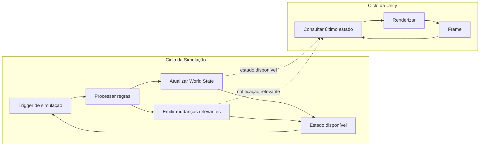

# Modelo de Execução

## Objetivo

Este documento descreve **como os ciclos de simulação e apresentação funcionam ao longo do tempo**. Ele complementa o diagrama estrutural, que responde quais são os principais contêineres e suas responsabilidades.

A ideia central é que **um frame da Unity não determina um processamento do `Simulation Core`**.

## Dois ciclos independentes



## O que pode disparar a simulação

O `Simulation Core` processa quando existe um **gatilho válido da simulação**, por exemplo:

- comando recebido;
- evento interno agendado;
- avanço do relógio/tick lógico, quando aplicável;
- outra alteração válida do mundo.

Não se deve afirmar que o Core é executado apenas por eventos, porque eventos também podem ser uma **saída** produzida pelo próprio Core.

## O que acontece quando não há mudança

Se nenhum gatilho exigir novo processamento, o estado simulado permanece válido.

Enquanto isso, a Unity pode continuar executando seu ciclo normal:

```text
Frame 1 ──► consulta estado V10 ──► render
Frame 2 ──► consulta estado V10 ──► render
Frame 3 ──► consulta estado V10 ──► render
Frame 4 ──► consulta estado V10 ──► render
```

Ou seja, vários frames podem ser renderizados sem uma nova execução das regras do domínio.

## O que acontece quando o mundo muda

Exemplo conceitual:

```text
Comando recebido
      │
      ▼
Simulation Core processa
      │
      ├──► World State: V10 → V11
      │
      └──► Evento de mudança
                │
                ▼
        informação disponível
                │
                ▼
        Presentation atualiza
                │
                ▼
           próximo frame
```

O importante é distinguir **processamento da simulação** de **representação visual**. A mudança pode ser produzida pelo Core sem que a renderização seja o mecanismo que executa essa mudança.

## Relação entre frequência de simulação e FPS

A frequência da simulação e a frequência de renderização são conceitos diferentes.

```text
SIMULAÇÃO
|---- processamento ----|--------|---- processamento ----|------
        gatilho                 gatilho

UNITY
|frame|frame|frame|frame|frame|frame|frame|frame|frame|frame|
```

Não existe uma regra arquitetural dizendo que:

```text
1 frame Unity = 1 execução do Simulation Core
```

A simulação pode processar menos vezes, mais vezes ou em momentos diferentes dos frames, conforme os gatilhos e a estratégia temporal adotada.

## Papel do tick lógico

O tick é um possível mecanismo de avanço da simulação. Ele representa o tempo do domínio e não deve ser confundido automaticamente com o frame rate da apresentação.

A frequência numérica e a implementação concreta do tick permanecem em aberto neste artefato.

## Invariantes

- `World State` é a fonte de verdade da simulação.
- Um frame novo não implica uma nova simulação.
- A Unity pode renderizar o último estado conhecido.
- A apresentação não altera diretamente o estado oficial.
- O Core não depende da taxa de FPS para aplicar suas regras.
- Eventos comunicam mudanças relevantes, mas não substituem o estado oficial.

## Limites deste modelo

Este documento não decide:

- frequência exata dos ticks;
- se a simulação será síncrona ou assíncrona;
- mecanismo de fila de comandos;
- mecanismo de entrega de eventos;
- estratégia de snapshot/versionamento;
- interpolação ou extrapolação visual;
- estratégia de concorrência.

Essas decisões pertencem a etapas posteriores de projeto e implementação.
